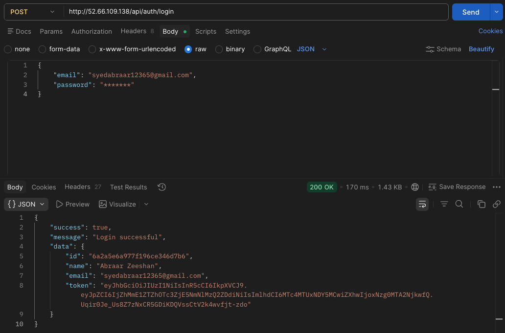
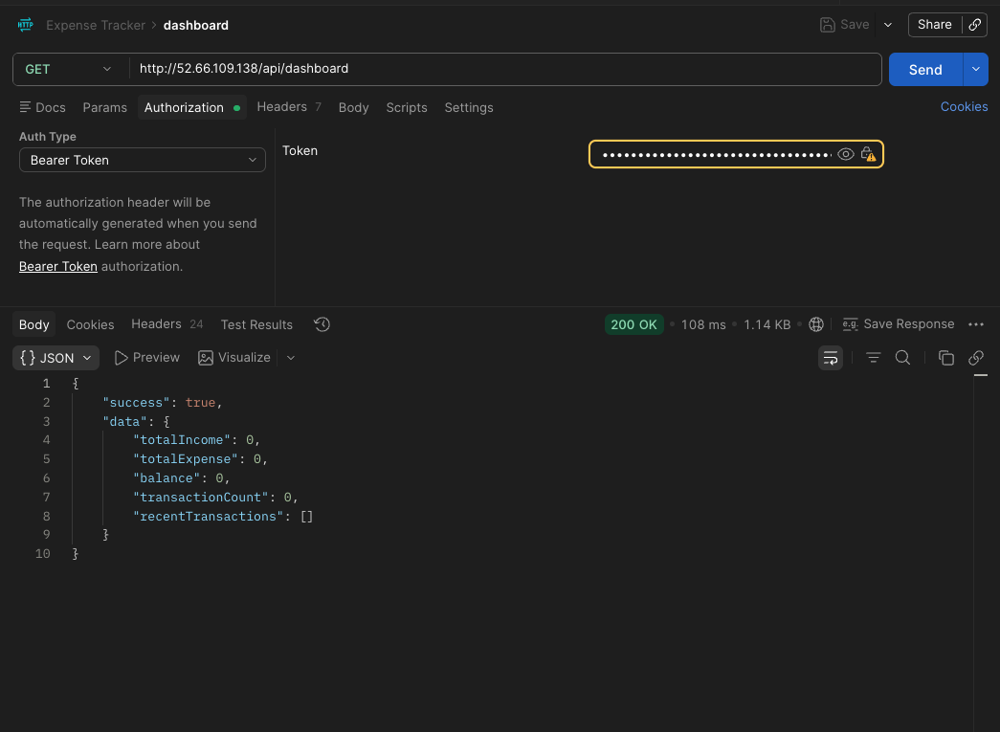
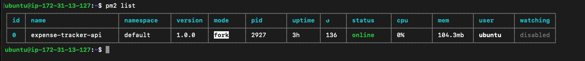
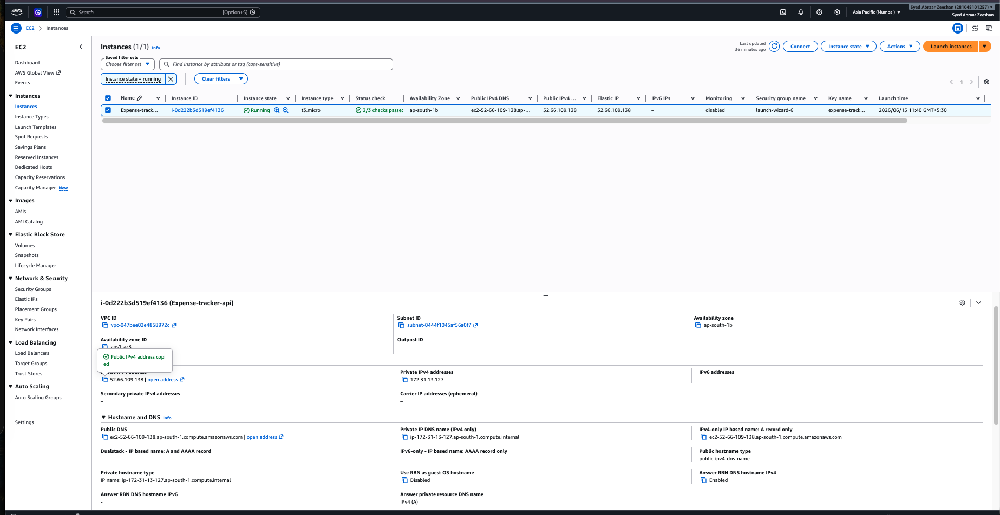

# Expense Tracker API


A production-ready REST API for personal finance management built with Node.js, **Express.js**, **MongoDB Atlas**, and **JWT Authentication**.

The application supports secure user authentication, password reset via email, expense management, dashboard analytics, and production deployment on AWS EC2 using PM2 and Nginx.

---

## 🌍 Live API

Base URL:
http://52.66.109.138

Health Check:
http://52.66.109.138/

## Features

- 🔐 JWT Authentication
- 📧 Password Reset via Email
- 💸 Expense CRUD Operations
- 📊 Dashboard Analytics APIs
- ✅ Input Validation using Zod
- 🚦 Rate Limiting
- 🛡️ Helmet Security Headers
- 📦 Compression Middleware
- 📋 Structured Logging with Pino
- ☁️ MongoDB Atlas Integration
- 🚀 AWS EC2 Deployment
- ⚙️ PM2 Process Management
- 🌐 Nginx Reverse Proxy

---

## 🛠️ Tech Stack

| Layer           | Technology    |
| --------------- | ------------- |
| Runtime         | Node.js       |
| Framework       | Express.js    |
| Database        | MongoDB Atlas |
| ODM             | Mongoose      |
| Authentication  | JWT           |
| Validation      | Zod           |
| Logging         | Pino          |
| Process Manager | PM2           |
| Reverse Proxy   | Nginx         |
| Cloud           | AWS EC2       |

---

## 🏗️ Architecture

```text
Flutter App
     │
     ▼
Nginx Reverse Proxy
     │
     ▼
PM2 Process Manager
     │
     ▼
Node.js / Express.js
     │
     ▼
MongoDB Atlas
```

---

## 📸 Backend Screenshots

Production API testing, deployment, and monitoring screenshots.

<table>
<tr>
<td align="center">
<b>🔐 Login API</b><br><br>

</td>

<td align="center">
<b>📊 Dashboard API</b><br><br>

</td>
</tr>

<tr>
<td align="center">
<b>⚙️ PM2 Process Manager</b><br><br>

</td>

<td align="center">
<b>☁️ AWS EC2 Deployment</b><br><br>

</td>
</tr>
</table>

## 📡 API Endpoints

### Authentication

| Method | Endpoint                        | Access  |
| ------ | ------------------------------- | ------- |
| POST   | /api/auth/register              | Public  |
| POST   | /api/auth/login                 | Public  |
| POST   | /api/auth/forgot-password       | Public  |
| PUT    | /api/auth/reset-password/:token | Public  |
| GET    | /api/auth/profile               | Private |

### Expenses

| Method | Endpoint          | Access  |
| ------ | ----------------- | ------- |
| GET    | /api/expenses     | Private |
| POST   | /api/expenses     | Private |
| GET    | /api/expenses/:id | Private |
| PUT    | /api/expenses/:id | Private |
| DELETE | /api/expenses/:id | Private |

### Dashboard

| Method | Endpoint       | Access  |
| ------ | -------------- | ------- |
| GET    | /api/dashboard | Private |

---

## 📁 Project Structure

```text
expense-tracker-backend/
│
├── config/
├── controllers/
├── middleware/
├── models/
├── routes/
├── utils/
├── validators/
├── screenshots/
├── server.js
├── package.json
└── README.md
```

---

## ⚙️ Local Setup

### Clone Repository

```bash
git clone https://github.com/syed-abraar-zeeshan/expense-tracker-backend.git

cd expense-tracker-backend
```

### Install Dependencies

```bash
npm install
```

### Create Environment Variables

Create a `.env` file in the root directory:

```env
PORT=4000

MONGO_URI=

JWT_SECRET=

EMAIL_USER=

EMAIL_PASS=
```

### Run Application

Development:

```bash
npm run dev
```

Production:

```bash
npm start
```

---

## ☁️ Deployment

This backend is deployed using:

- AWS EC2
- Elastic IP
- MongoDB Atlas
- PM2
- Nginx Reverse Proxy

### PM2 Commands

```bash
pm2 start server.js --name expense-tracker-api

pm2 save

pm2 startup

pm2 list
```

---

## 🔒 Security Features

- Password Hashing using bcryptjs
- JWT Authentication
- Password Reset Tokens
- Helmet Security Headers
- Rate Limiting
- Request Validation using Zod
- Secure Environment Variables
- MongoDB Atlas Network Security

---

## 👨‍💻 Author

### Syed Abraar Zeeshan

Flutter Developer (4+ Years) | Flutter Full Stack Developer

- Flutter, Riverpod, GetX, BLoC
- Node.js, Express.js, MongoDB
- AWS EC2, PM2, Nginx
- REST API Development

GitHub:

https://github.com/syed-abraar-zeeshan

Backend Repository:

https://github.com/syed-abraar-zeeshan/expense-tracker-backend

Flutter Repository:

https://github.com/syed-abraar-zeeshan/expense-tracker-flutter
